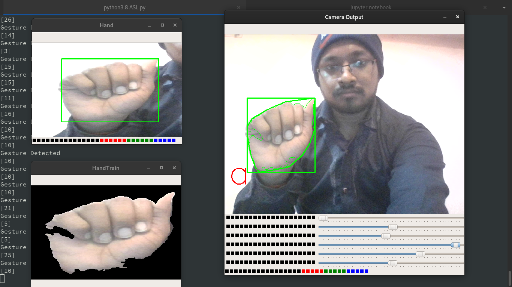
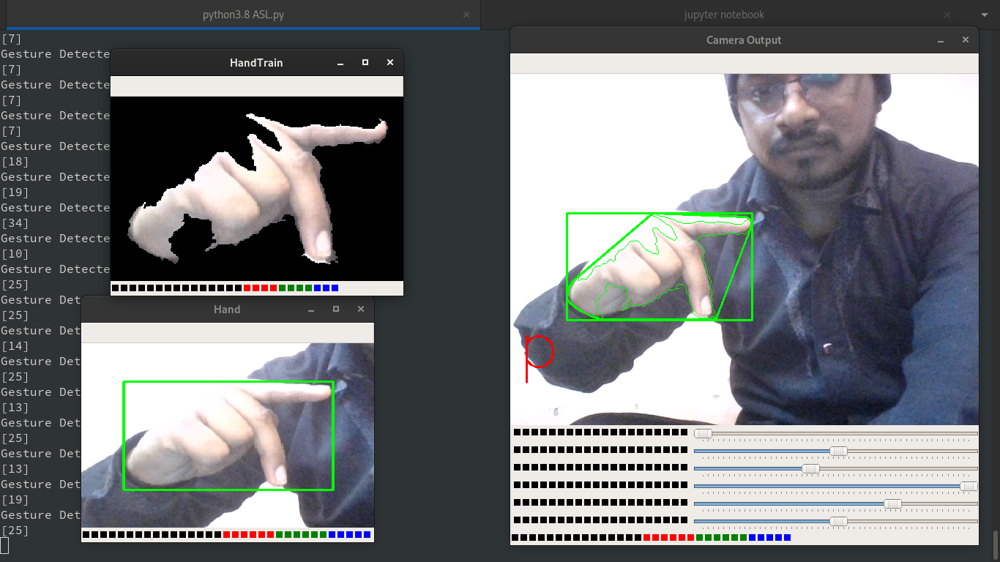
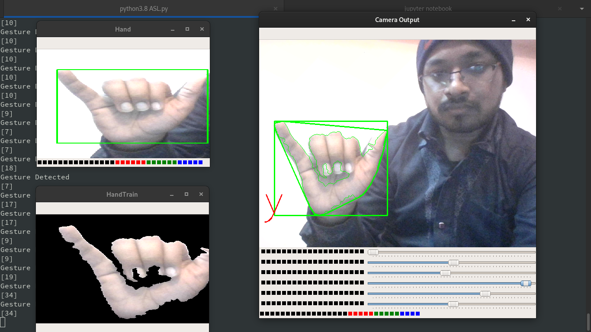
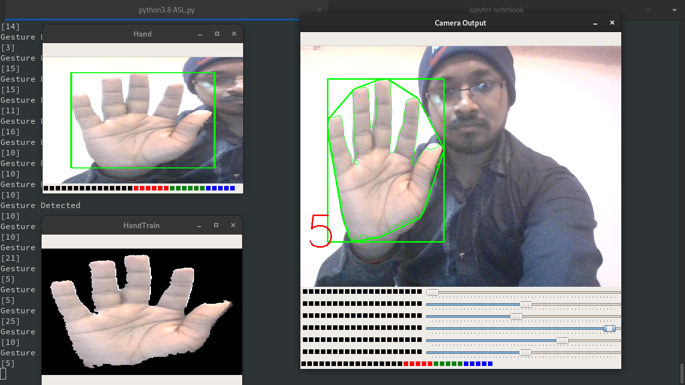
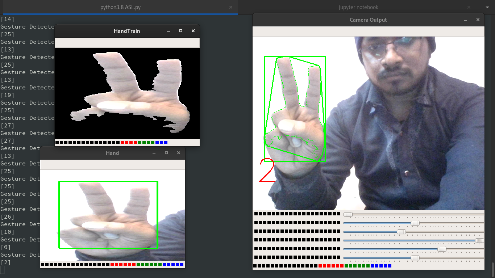

# American-Sign-Language-Recognition

Hand gesture is one of the method used in sign language for non-verbal communication. It is most commonly used by deaf & dumb people who have hearing or speech problems to communicate among themselves or with normal people. This project presents a system prototype that is able to automatically recognize sign language to help deaf and dumb people to communicate more effectively with each other or normal people.

# Requirements

This project is lastly tested with the following version of tools

```
Tensorflow version 2.3.1
Keras version 2.4.3
Python 3.8.1
```


# Installation Instructions

```bash
sudo pip install opencv-python
sudo pip install keras
sudo pip install tensorflow
python ASL.py
```

# Results

Though the model has not performed very good because of lack of training data & has been trained for less epochs, also it doesn't perform well in case of background noise, but with significant increase in data points, and more training, could result in better performance.

Identifying Gesture : a


Identifying Gesture : p


Identifying Gesture : y


Identifying Gesture : 5


Identifying Gesture : 2

